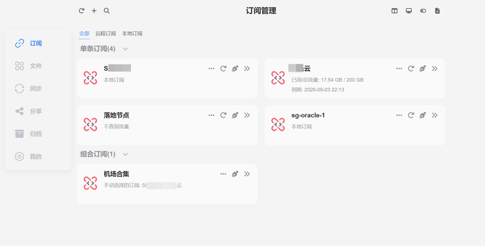
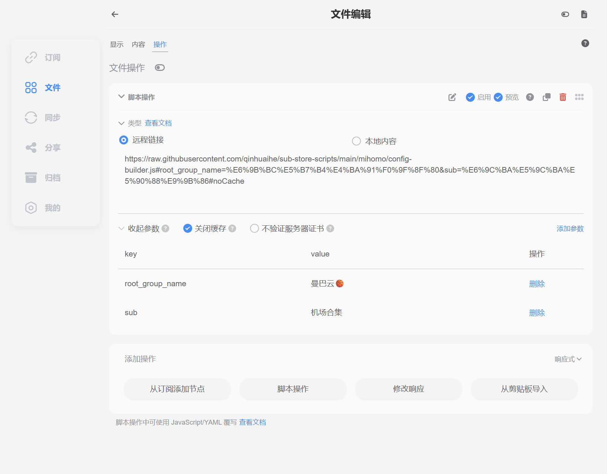

# Sub-Store Scripts

一套围绕 **Sub-Store + Mihomo / Clash.Meta** 的配置模板、文件操作脚本、自定义规则和管理工具。

核心目标是：**只维护一套基础 Mihomo 模板，在 Sub-Store 文件操作中配置固定参数，并允许通过最终请求 URL 临时覆盖参数，从而生成不同客户端需要的完整配置。**

---

## 项目结构

```text
sub-store-scripts/
├── README.md
├── .gitignore
├── example1.png                 # Sub-Store 配置示例图
├── example2.png                 # Sub-Store 配置示例图
│
├── templates/
│   └── mihomo-base.yaml         # Mihomo 基础模板
│
├── mihomo/
│   ├── config-builder.js        # 核心 Mihomo 配置构建脚本
│   └── inject-custom-rules.js   # 独立自定义规则注入脚本
│
├── rules/
│   ├── custom-direct.yaml       # 强制直连规则
│   ├── custom-proxy.yaml        # 强制代理规则
│   └── custom-reject.yaml       # 强制拒绝规则
│
├── rename-proxies.js            # 节点重命名/规范化脚本
│
├── bootstrap/
│   ├── .env.example             # Bootstrap 环境变量示例
│   └── bootstrap.py             # 新实例初始化骨架
│
└── skills/
    └── substore-manager/
        ├── SKILL.md              # Skill 指令
        ├── .env.example          # Skill 环境变量示例
        └── scripts/
            └── substore.py       # Sub-Store API 辅助脚本
```

### 文件作用

| 文件 | 作用 |
| --- | --- |
| `templates/mihomo-base.yaml` | Mihomo 基础配置模板，提供端口、DNS、策略组、规则等基础结构，不写死具体代理节点。 |
| `mihomo/config-builder.js` | **核心脚本**。读取主订阅、Landing、Root Group、运行模式、Profile、DNS 等参数，生成最终 Mihomo 配置。 |
| `mihomo/inject-custom-rules.js` | 在已有完整 Mihomo 配置上独立注入 `custom-direct` / `custom-proxy` / `custom-reject`。 |
| `rules/custom-direct.yaml` | 自定义强制直连匹配条件。 |
| `rules/custom-proxy.yaml` | 自定义强制代理匹配条件。 |
| `rules/custom-reject.yaml` | 自定义强制拒绝匹配条件。 |
| `rename-proxies.js` | 对 Sub-Store 节点名称进行规范化和信息增强。 |
| `bootstrap/bootstrap.py` | 新 Sub-Store 实例初始化骨架，目前以连接检查和 Dry Run 为主。 |
| `skills/substore-manager/` | 用于通过 Skill / Agent 管理 Sub-Store 订阅并快速生成可复制链接。 |
| `example1.png` / `example2.png` | Sub-Store 文件及脚本参数配置示例。 |

---

## 核心工作流

```text
Subscription / Collection
          │
          │ sub
          ▼
 templates/mihomo-base.yaml
          │
          ▼
 mihomo/config-builder.js
          │
     ┌────┴────┐
     │         │
  主节点     Landing（可选）
     │         │
     └────┬────┘
          ▼
    完整 Mihomo 配置
          │
          ▼
 Mihomo / Clash.Meta 客户端
```

`config-builder.js` 不绑定具体机场名称。主节点来源由 `sub` 指定，Landing 由 `landing` 指定。

---

## 快速开始

### 1. 添加订阅或组合订阅

例如：

```text
机场A
机场B
oracle-sg-1

机场合集
├── 机场A
└── 机场B
```

### 2. 创建 Mihomo 文件

在 Sub-Store 的「文件」中创建 Mihomo 配置，基础模板使用：

```text
templates/mihomo-base.yaml
```

### 3. 添加 `config-builder.js`

在：

```text
文件 → 操作 → 脚本操作
```

添加远程脚本：

```text
https://raw.githubusercontent.com/qinhuaihe/sub-store-scripts/main/mihomo/config-builder.js
```

推荐开启「关闭缓存」，便于脚本更新后及时生效。

### 4. 在脚本操作里配置固定参数（推荐）

`sub`、`root_group_name` 等**不需要写进最终分享链接**，可以直接在 Sub-Store 的脚本操作参数中设置。

例如：

```text
sub             = 机场合集
root_group_name = 曼巴云🏀
```

示例界面：





这样文件本身就已经知道：

```text
主节点来源 = 机场合集
Root Group = 曼巴云🏀
```

最终复制出来的分享链接可以保持非常干净，不需要重复携带这些固定参数。

---

## 参数从哪里传？

`config-builder.js` 同时支持两种参数来源：

```text
① 最终请求 URL Query
② Sub-Store 文件操作参数（$arguments）
```

优先级为：

```text
最终请求 URL 参数
        ↓ 优先
文件操作参数（$arguments）
        ↓
脚本内部默认值
```

因此推荐把参数分成两类。

**固定参数放在文件操作里：**

```text
sub=机场合集
root_group_name=曼巴云🏀
```

**需要临时变化的参数放在最终 URL：**

```text
?landing=oracle-sg-1
?mihomo_mode=global
?profile=phone
```

例如文件操作已经配置：

```text
sub=机场合集
root_group_name=曼巴云🏀
```

那么平时可以直接使用文件分享链接；临时需要 Global + Landing 时只需要：

```text
<分享链接>?landing=oracle-sg-1&mihomo_mode=global
```

无需再次传 `sub` 和 `root_group_name`。

> `sub` 对脚本来说仍然是必填参数，但它可以来自文件操作参数，不代表必须出现在最终分享 URL 中。

---

## 参数说明

参数名称匹配**大小写不敏感**，推荐统一使用 snake_case。

| 参数 | 必填 | 推荐位置 | 示例 | 说明 |
| --- | --- | --- | --- | --- |
| `sub` | 是 | 文件操作 | `机场合集` | 主节点来源。优先 Collection，找不到再找 Subscription。 |
| `root_group_name` | 否 | 文件操作 | `曼巴云🏀` | 最终 Root Group 名称，默认 `🚀 节点选择`。 |
| `landing` | 否 | URL / 文件操作 | `oracle-sg-1` | Landing Subscription；不传或 `none` 表示禁用。支持逗号分隔多个订阅。 |
| `mihomo_mode` | 否 | URL / 文件操作 | `global` | `rule` / `global` / `direct`。 |
| `profile` | 否 | URL / 文件操作 | `phone` | `default` / `home` / `router` / `phone`。 |
| `dns` | 否 | URL / 文件操作 | `global` | `default` / `cn` / `global` / `off`。 |
| `rule_provider_base` | 否 | 文件操作 | `https://.../rules` | 设置后由 `config-builder.js` 注入自定义 Rule Provider。 |

同时兼容部分 camelCase 参数，例如：

```text
rootGroupName
mihomoMode
ruleProviderBase
```

推荐新配置统一使用：

```text
root_group_name
mihomo_mode
rule_provider_base
```

---

## `sub`：主节点来源

`sub` 是 `config-builder.js` 唯一必须提供的业务参数，但推荐直接配置在文件操作中。

解析顺序：

```text
sub=xxx
   │
   ├─ 1. 查找 Collection: xxx
   │       └─ 找到有效节点 → 使用
   │
   └─ 2. 查找 Subscription: xxx
           └─ 找到有效节点 → 使用

都找不到 / 没有有效节点 → 报错
```

因此既可以：

```text
sub=机场合集
```

也可以：

```text
sub=机场A
```

如果 Collection 和 Subscription 同名，**Collection 优先**。

---

## Landing 链式代理

Landing 默认关闭。

以下情况都表示不使用 Landing：

```text
不传 landing
landing=none
landing=off
landing=false
landing=0
```

启用：

```text
landing=oracle-sg-1
```

`landing` 直接代表 **Sub-Store Subscription 名称**，没有任何名为「落地节点」的特殊订阅逻辑。

指定：

```text
landing=落地节点
```

就只是读取名为「落地节点」的普通 Subscription。

Landing 节点会设置：

```yaml
dialer-proxy: 🚀 手动选择
```

形成：

```text
客户端
  ↓
Root Group
  ↓
Landing
  ↓ dialer-proxy
🚀 手动选择
  ↓
sub 主节点
  ↓
Internet
```

多个 Landing Subscription：

```text
landing=oracle-sg-1,oracle-jp-1
```

脚本会合并其中节点。显式指定的任意 Landing 订阅不存在或没有有效节点时会直接报错，不会静默退化为直出。

---

## `root_group_name`

默认：

```text
🚀 节点选择
```

推荐在文件操作参数中固定，例如：

```text
root_group_name=曼巴云🏀
```

无 Landing 时：

```text
曼巴云🏀
├── 主节点 A
├── 主节点 B
└── ...
```

有 Landing 时：

```text
曼巴云🏀
├── Landing A
├── Landing B
└── 🚀 手动选择
      ├── 主节点 A
      ├── 主节点 B
      └── ...
```

---

## `mihomo_mode`

支持：

```text
rule
global
direct
```

例如文件已经配置好 `sub` 后，临时切 Global 只需要：

```text
<分享链接>?mihomo_mode=global
```

Global 模式下脚本还会建立/修正 `GLOBAL` 策略组，使其指向最终 `root_group_name`，避免导入客户端后默认落到 `DIRECT`。

客户端之后仍可手动切换运行模式。

---

## Profile 与 DNS

Profile：

```text
profile=home
→ allow-lan=true
→ 未显式指定 dns 时默认 cn

profile=router
→ allow-lan=true
→ bind-address=*
→ 未显式指定 dns 时默认 cn

profile=phone
→ allow-lan=false
→ 未显式指定 dns 时默认 global
```

DNS：

```text
dns=default   # 保持模板
dns=cn
dns=global
dns=off
```

显式 `dns` 参数优先于 Profile 的 DNS 默认值。

---

## 自定义规则

仓库包含：

```text
rules/
├── custom-direct.yaml
├── custom-proxy.yaml
└── custom-reject.yaml
```

含义：

```text
custom-direct  → DIRECT
custom-proxy   → 代理策略组
custom-reject  → REJECT
```

### 方式一：由 `config-builder.js` 注入

给脚本传：

```text
rule_provider_base=https://raw.githubusercontent.com/qinhuaihe/sub-store-scripts/main/rules
```

即可注入三个 Rule Provider，并让 `custom-proxy` 默认使用最终 `root_group_name`。

### 方式二：对已有 Mihomo 文件二次加工

使用：

```text
mihomo/inject-custom-rules.js
```

适合：

```text
已有完整 Mihomo 配置
        ↓
inject-custom-rules.js
        ↓
增加 custom rules
```

该脚本的 `rule_provider_base` 为必填参数，并可通过 `proxy_group` / `proxyGroup` 指定 `custom-proxy` 使用的策略组。

---

## 节点重命名

`rename-proxies.js` 用于 Subscription / Collection 节点处理流程，负责节点名称规范化、地区识别以及订阅辅助信息展示。

典型流程：

```text
Subscription
     ↓
rename-proxies.js
     ↓
标准化节点
     ↓
Collection / config-builder.js
```

---

## Sub-Store Manager Skill

```text
skills/substore-manager/
├── SKILL.md
├── .env.example
└── scripts/
    └── substore.py
```

用于让 AI Agent / Skill 管理 Sub-Store Subscription，并生成可复制的 Mihomo 链接。

配置：

```bash
cp skills/substore-manager/.env.example skills/substore-manager/.env
```

主要环境变量：

```text
SUBSTORE_BASE_URL
SUBSTORE_API_KEY
SUBSTORE_MIHOMO_FILE
SUBSTORE_AUTH_HEADER
SUBSTORE_AUTH_SCHEME
```

不要提交真实 `.env` 或 API Key。

---

## Bootstrap

```text
bootstrap/
├── .env.example
└── bootstrap.py
```

目标是帮助新部署的 Sub-Store 实例快速建立本仓库需要的结构。

当前版本仍是安全骨架，默认 Dry Run：

```bash
cp bootstrap/.env.example bootstrap/.env
python3 bootstrap/bootstrap.py
```

目前主要完成：读取环境变量、检查 Sub-Store API、显示计划结构。`--apply` 的完整资源创建逻辑仍待按照实际 Sub-Store API Schema 完善。

---

## 推荐使用方式

对于一个长期使用的 Mihomo 文件，建议固定：

```text
文件操作参数：
sub=机场合集
root_group_name=曼巴云🏀
```

然后最终分享 URL 只携带真正需要变化的内容。

普通 Rule：

```text
<分享链接>
```

指定 Landing：

```text
<分享链接>?landing=oracle-sg-1
```

Global：

```text
<分享链接>?mihomo_mode=global
```

Global + Landing：

```text
<分享链接>?landing=oracle-sg-1&mihomo_mode=global
```

手机 Profile：

```text
<分享链接>?profile=phone
```

临时覆盖文件中的 Root Group：

```text
<分享链接>?root_group_name=🚀 临时代理
```

如果参数值包含中文、Emoji、空格或其他特殊字符，实际 URL 中应进行 URL Encode。

---

## 设计原则

1. **固定配置放文件，动态变化放 URL。** 分享链接保持尽可能干净。
2. **配置与数据解耦。** 脚本不写死具体机场或 Landing Subscription 名称。
3. **Landing Opt-in。** 不传 `landing` 就不启用链式代理。
4. **Landing Fail Closed。** 指定 Landing 后找不到就报错，不静默直出。
5. **一个模板，多种运行方式。** Phone / Router / Rule / Global / Landing 都复用同一个 Mihomo 文件。
6. **GitHub 是配置代码仓库。** 模板、脚本、规则和 Skill 都可版本化维护。

---

## 安全建议

- 不要把机场真实订阅 URL 提交到公开仓库。
- 不要提交真实 `.env`。
- 不要在脚本中硬编码 Sub-Store API Key。
- 管理 API 建议通过可信网络、反向代理认证或 Tailscale 等方式保护。
- 对外分享的配置入口与管理 API 尽量分离权限。

---

## License

本项目采用 [MIT License](./LICENSE) 开源。

你可以自由使用、复制、修改、合并、发布、分发、再授权和销售本项目的软件副本，包括商业用途；使用时需保留原始版权声明和 MIT 许可声明。

Copyright (c) 2026 qinhuaihe
